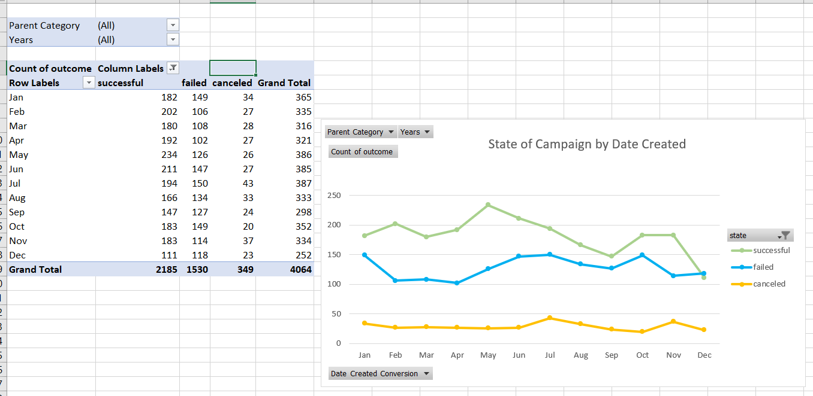
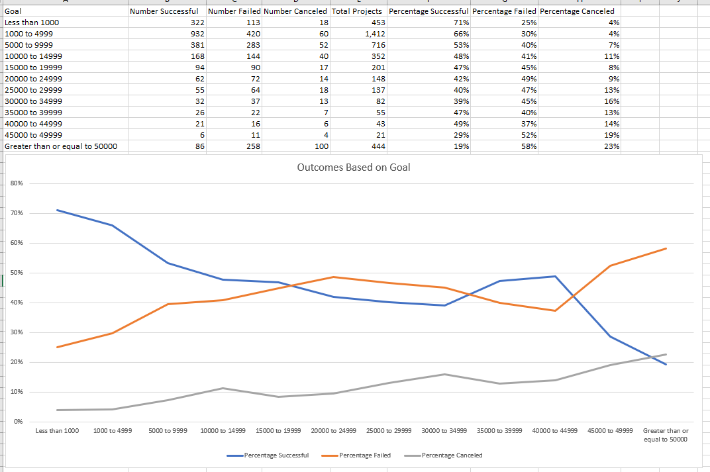

# Excel: Kickstart

## Background

Over $2 billion has been raised using the massively successful crowdfunding service, Kickstarter, but not every project has found success. Of the more than 300,000 projects launched on Kickstarter, only a third have made it through the funding process with a positive outcome.

Getting funded on Kickstarter requires meeting or exceeding the project's initial goal, so many organizations spend months looking through past projects in an attempt to discover some trick for finding success. For this week's homework, you will organize and analyze a database of 4,000 past projects in order to uncover any hidden trends.

## Purpose

Using the Excel table provided, modify and analyze the data of 4,000 past Kickstarter projects as you attempt to uncover some market trends.

### Analysis of Outcomes Based on Launch Date

This graph shows the highest success rate in May and the lowest failure rate in April. Success rates are lowest in December.

### Analysis of Outcomes Based on Goals

This graph shows the lower the goal, the more likely the kickstarter campaign was to succeed (with the proper backing).

## Results

Conclusion:
 * More backers means the campaign was more likely to reach their goal. 
 * Plays are the most frequent kickstarter campaign.
 * The goal of less than 1000 has the highest success rate as well as the lowest fail rate, meaning it is the safest to back.
